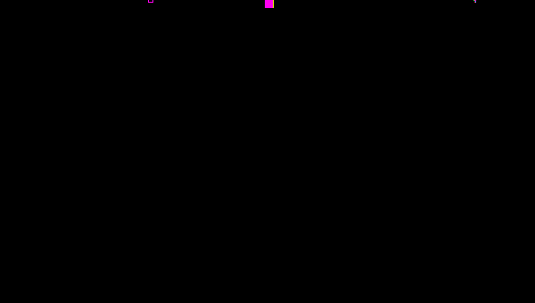

# Cybertronian Code-Rain

AllSpark terminal — a Matrix-style code-rain animation rendered in glowing
Cybertronian glyphs, surging gold and neon cyan against black.

## Run

Open `index.html` in any browser. No build, no dependencies.

[](https://github.com/billybox1926-jpg/Cybertronian-Code-Rain)

## Install

```bash
npm install @billybox1926-jpg/cybertronian-code-rain
```

## Usage

```html
<canvas id="allspark"></canvas>
<script type="module">
  import { init } from '@billybox1926-jpg/cybertronian-code-rain';
  init('allspark', {
    color: '#00f0ff',
    fontSize: 16,
    fps: 30,
    fadeAlpha: 0.08,
    trailGlyphs: 3,
    trailColor: 'rgba(255, 215, 0, ALPHA)'
  });
</script>
```

## Quick start

```bash
git clone https://github.com/billybox1926-jpg/Cybertronian-Code-Rain.git
# Linux
xdg-open Cybertronian-Code-Rain/index.html
# macOS
open Cybertronian-Code-Rain/index.html
```

## Demo



## Customize

Edit `index.html` to change the look and feel:

- Glyph set: `const glyphs = "ΔΞΨΩ..."`  
- Font size: `const fontSize = 16`
- Text color: `ctx.fillStyle = '#00f0ff'`
- Frame rate: `setInterval(draw, 33)` (~30 FPS)
- Fade/tail: `ctx.fillStyle = 'rgba(0, 0, 0, 0.08)'` — higher alpha = shorter trail

## Accessibility

The animation uses a stable single-color scheme and a semitransparent fade
overlay to reduce strong flashing. If you are sensitive to motion or bright
content, reduce brightness, increase fade alpha, or stop the animation by
removing the interval.

## License

MIT. See [LICENSE](LICENSE).
